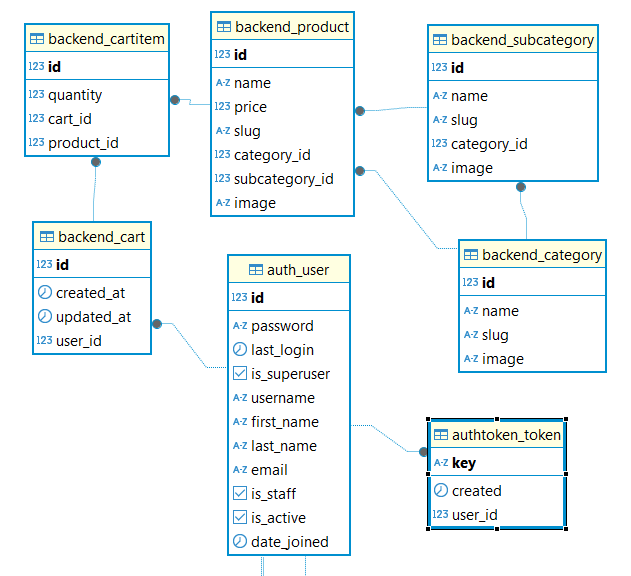

# Магазин API

## 1. О проекте

**Интернет-магазин API** — это backend-приложение для работы с каталогом товаров (категории, подкатегории, продукты) и корзиной покупателя.

**Версия:** 1.0.0

**Документация Swagger:** [/api/docs/](http://localhost:8000/api/docs/)

**Документация ReDoc:** [/api/redoc/](http://localhost:8000/api/redoc/)

**Схема OpenAPI:** [/api/schema/](http://localhost:8000/api/schema/)

**Функционал админ-панели:**
- Управление категориями и подкатегориями (создание, редактирование, удаление)
- Управление товарами (добавление, изменение, удаление)

**Особенности:**
- При загрузке изображения товара через админку автоматически создаются три версии (маленькая, средняя, большая)
- Готовые ссылки на все три размера возвращаются в эндпоинте `/api/products/`

**Технологии:** Django, Django REST Framework, drf-spectacular, PostgreSQL

## 2. Роли пользователей

### Неавторизованный пользователь

- Просмотр всех категорий с подкатегориями (с пагинацией)

- Просмотр всех товаров (с пагинацией):

    - Наименование и slug

    - Цена

    - Категория и подкатегория

    - Изображения в 3-х размерах (small, medium, large)

- Регистрация по username и паролю (выдача токена)

- Авторизация по username и паролю (выдача токена)

### Авторизованный пользователь

- Всё, что доступно неавторизованному пользователю

- Управление корзиной:

    - Просмотр содержимого корзины

    - Добавление товара (или обновление количества)

    - Удаление конкретного товара

    - Полная очистка корзины

### Администратор

- Доступ к админ-панели /admin/

- Полное управление категориями и подкатегориями

- Полное управление товарами

## 3. Схема базы данных

**Основные модели:**

- **User** — пользователь (встроенная модель Django)
- **Category** — категория товаров
- **Subcategory** — подкатегория товаров
- **Product** — товар
- **Cart** — корзина пользователя
- **CartItem** — позиция в корзине

**Связи:**
- Category → Subcategory (один ко многим)
- Subcategory → Product (один ко многим)
- User → Cart (один к одному)
- Cart → CartItem (один ко многим)
- Product → CartItem (один ко многим)




## 4. Эндпоинты API
Базовый URL: /api/

### Авторизация (auth)

- POST /register/ — Регистрация нового пользователя

- POST /login/ — Авторизация и получение токена

### Каталог (catalog)

- GET /categories/ — Список всех категорий с подкатегориями

- GET /products/ — Список всех товаров

### Корзина (cart)

- GET /cart/ — Просмотр содержимого корзины

- POST /cart/items/ — Добавление или обновление товара

- DELETE /cart/items/{product_slug}/ — Удаление конкретного товара

- DELETE /cart/clear/ — Полная очистка корзины

### Документация

- GET /docs/ — Swagger UI документация

- GET /schema/ — OpenAPI схема в формате JSON

- GET /redoc/ — ReDoc документация


## 5. Структура проекта

```text
projectShopAkatosfera/
├── backend/                          # Основное приложение
│   ├── fixtures/                     # Тестовые данные
│   ├── migrations/                   # Миграции БД
│   ├── __init__.py
│   ├── admin.py                      # Настройки админки
│   ├── apps.py                       # Конфигурация приложения
│   ├── models.py                     # Модели БД
│   ├── serializers.py                # Сериализаторы
│   ├── urls.py                       # URL-маршруты приложения
│   ├── utils.py                      # Вспомогательные функции
│   ├── validators.py                 # Валидаторы
│   └── views.py                      # Представления
│
├── docs_images/                      # Изображения для документации
│
├── media/                            # Загруженные изображения (не в git)
├── shop/                             # Конфигурация проекта
│   ├── __init__.py
│   ├── asgi.py
│   ├── settings.py                   # Настройки проекта
│   ├── urls.py                       # Главные URL-маршруты
│   └── wsgi.py
│
├── tests/                             # Тесты
│   ├── __init__.py
│   ├── test_cart_add_update_view.py
│   └── test_cart_detail_view.py
│
├── venv/                               # Виртуальное окружение
├── .env                                # Переменные окружения (не в git)
├── .env.example                        # Шаблон для переменных окружения
├── .gitignore
├── main.py
├── manage.py                            # Управление Django
└── requirements.txt                     # Зависимости
```

## 6. Запуск проекта локально


#### 1. Клонировать репозиторий
```bash
git clone <url-репозитория>
```

#### 2. Установить зависимости
```bash
pip install -r requirements.txt
```

#### 3. Настроить переменные окружения
```bash
cp .env.example .env
````
указать свои данные в .env

#### 4. Применить миграции
```bash
python manage.py migrate
```

#### 5. Подготовить изображения

Подготовьте папку для изображений:
```text
    media/
    ├── categories/     # изображения категорий
    ├── subcategories/  # изображения подкатегорий
    └── products/       # изображения товаров
```
Добавьте изображения с соответствующими именами:

- media/categories/electronic.png

- media/subcategories/smartphone.png

- media/products/iphone.png

- media/products/washing-machine.png

Можно использовать любые тестовые изображения, просто переименовав их.


#### 6. Загрузить фикстуры (в правильном порядке)
```bash
python manage.py loaddata backend/fixtures/category.json
python manage.py loaddata backend/fixtures/subcategory.json
python manage.py loaddata backend/fixtures/users.json
python manage.py loaddata backend/fixtures/products.json
python manage.py loaddata backend/fixtures/carts.json
python manage.py loaddata backend/fixtures/cart_items.json
```

#### 7. Создать токен для пользователя
После загрузки фикстур выполните:
```bash
python manage.py shell

from django.contrib.auth import get_user_model
from rest_framework.authtoken.models import Token
user = get_user_model().objects.get(username='user1')
token, _ = Token.objects.get_or_create(user=user)
print(token.key)
```

#### 8. Запустить тесты
```bash
python manage.py test
```

#### 9. Запустить сервер
```bash
python manage.py runserver
```

#### 10. Проверить суперпользователя
Проверить, загрузился ли админ из users.json:

- Откройте http://localhost:8000/admin/

- Попробуйте войти с логином *admin* и паролем *12345*

Если нет - выполните:
```bash
python manage.py createsuperuser
```

#### 11. Открыть документацию

- Swagger: [/api/docs/](http://localhost:8000/api/docs/)

- ReDoc: [/api/redoc/](http://localhost:8000/api/redoc/)
